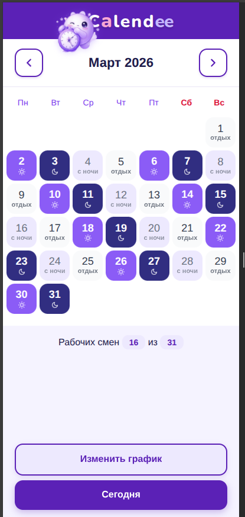
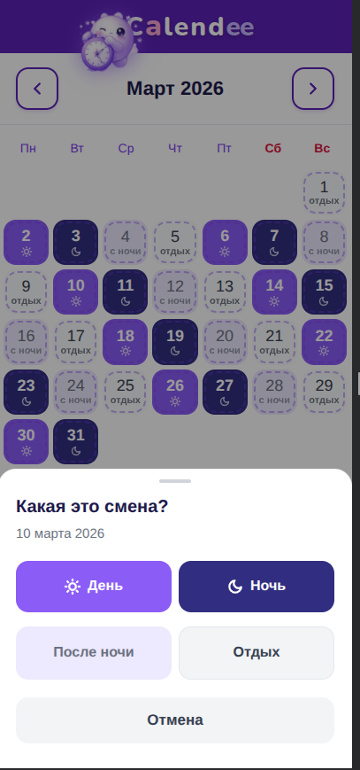

#  C**a**lend*ee*

PWA-календарь сменного рабочего графика.

## Что это

Простое приложение для тех, кто работает по сменному графику и хочет быстро узнать -- рабочий сегодня день или нет.

Цикл из 4 фаз, который идёт нон-стопом:
- **День** -- дневная смена
- **Ночь** -- ночная смена
- **С ночи** -- отдых после ночной
- **Отдых** -- выходной

Достаточно один раз указать фазу для любого дня -- и весь календарь рассчитается автоматически, вперёд и назад.

<p align="center">
  
  &nbsp;&nbsp;
  
</p>

## Установка

Открыть в Chrome на Android, нажать **"Добавить на главный экран"**.

```
https://scott-walker.github.io/calendo/
```

## Разработка

```bash
npm install
npm run dev
```

## Сборка

```bash
npm run build
```

## Стек

Vanilla JS + Vite. Никаких фреймворков.
